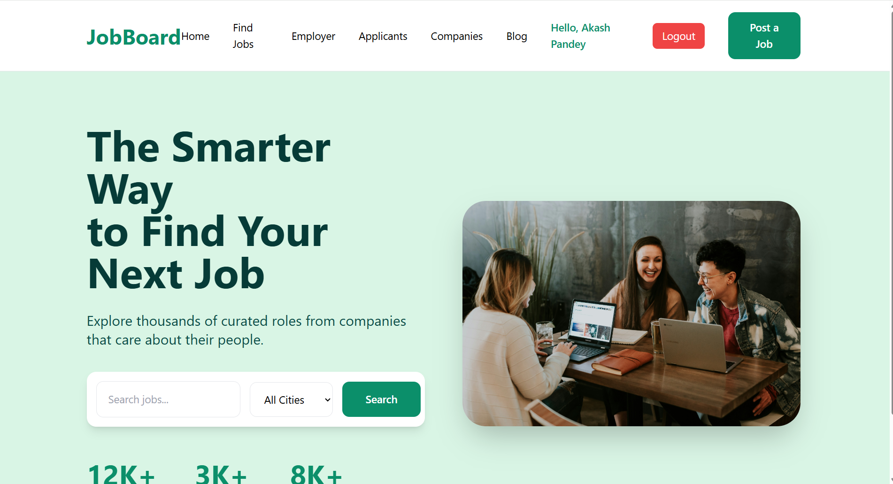
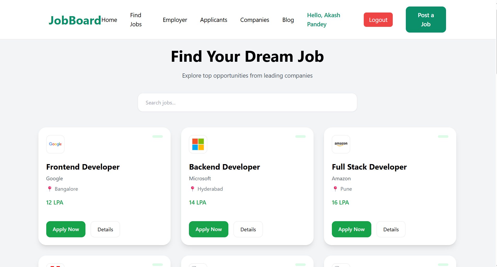
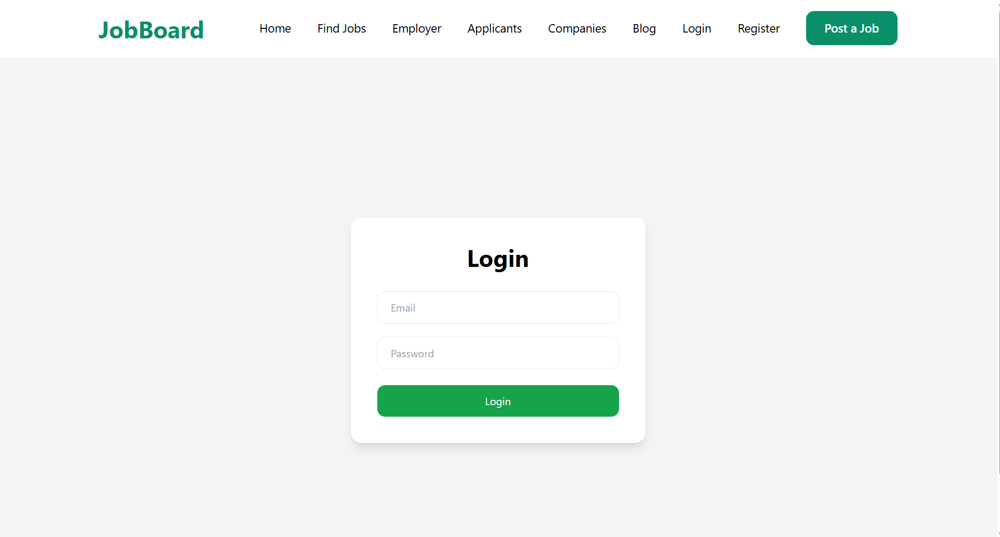
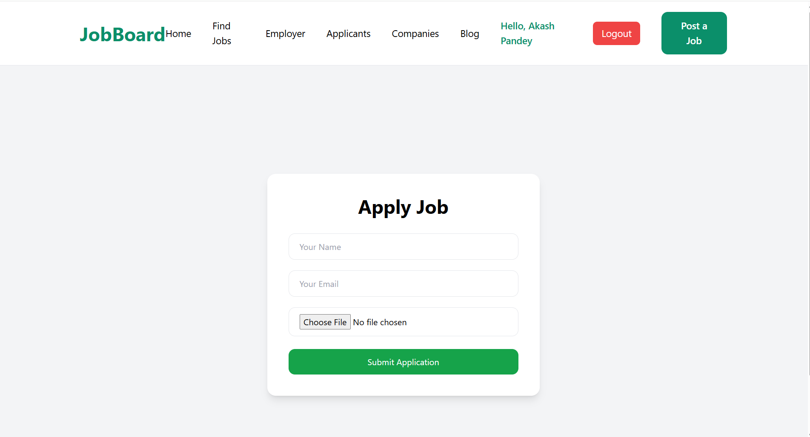
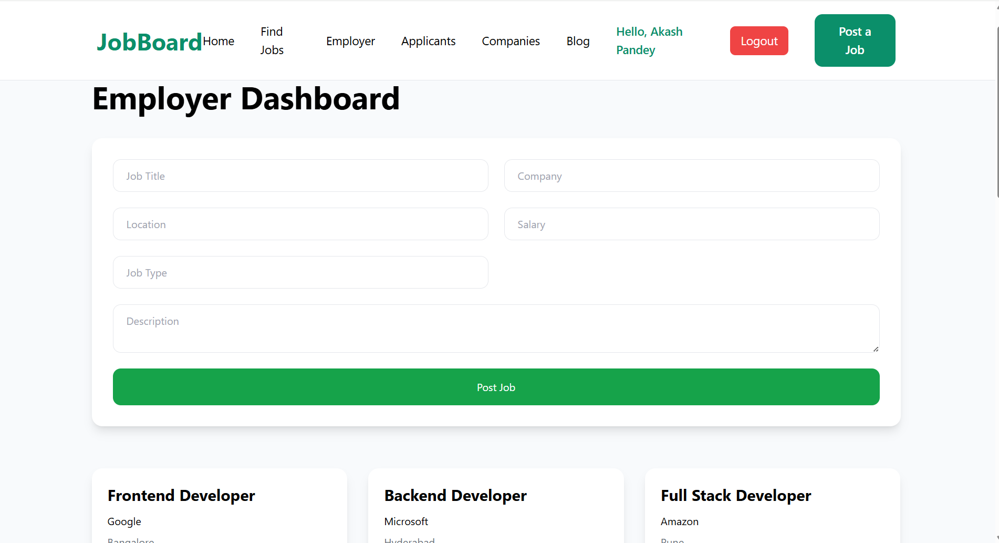

# 💼 Job Board Portal

A full-stack Job Board web application where users can browse jobs, register, log in, and apply for jobs. Employers can manage job listings and view applicants.

## 🚀 Live Demo

🌐 Frontend: https://codsoft-level1-job-board.vercel.app/login

🔗 Backend API: https://job-board-backend-tm6e.onrender.com

---

## 📌 Features

### 👨‍💼 User Features
- View all available jobs
- Search and browse job listings
- User Registration and Login
- Apply for jobs
- Upload resume while applying
- Responsive UI for desktop and mobile

### 🏢 Employer Features
- Employer Dashboard
- View applicants
- Manage job postings

---

## 🛠️ Tech Stack

### Frontend
- React.js
- React Router DOM
- Tailwind CSS
- Axios

### Backend
- Node.js
- Express.js
- MongoDB Atlas
- Mongoose
- JWT Authentication

### Deployment
- Frontend: Vercel
- Backend: Render
- Database: MongoDB Atlas

---

## 📂 Project Structure

```text
job-board-project/
│
├── client/                 # React Frontend
│   ├── src/
│   ├── public/
│   └── package.json
│
├── server/                 # Node.js Backend
│   ├── controllers/
│   ├── models/
│   ├── routes/
│   ├── middleware/
│   └── index.js
│
└── README.md


## API Endpoints

### Authentication

| Method | Endpoint | Description |
|--------|-----------|-------------|
| POST | /api/auth/register | Register User |
| POST | /api/auth/login | Login User |

### Jobs

| Method | Endpoint | Description |
|--------|-----------|-------------|
| GET | /api/jobs | Get All Jobs |
| GET | /api/jobs/:id | Get Single Job |

### Applications

| Method | Endpoint | Description |
|--------|-----------|-------------|
| POST | /api/applications/apply | Apply for a Job |


## 📸 Screenshots

### Home Page


### Jobs Page


### Login Page


### Apply Job Page


### Employer Dashboard


---

## Future Improvements

- Email notifications
- Advanced job filters
- Resume download option
- Admin Dashboard
- Save Jobs feature
- Company Profiles

---

## Learning Outcomes

This project helped in understanding:

- MERN Stack Development
- REST APIs
- Authentication using JWT
- MongoDB Integration
- File Upload Handling
- Deployment using Vercel and Render

---

## Author

**Akash Pandey**

GitHub: https://github.com/akashupp2024-sys

LinkedIn: https://www.linkedin.com/in/akash-pandey-15bb18338/

---

## License

This project is developed for educational purposes and internship learning.
